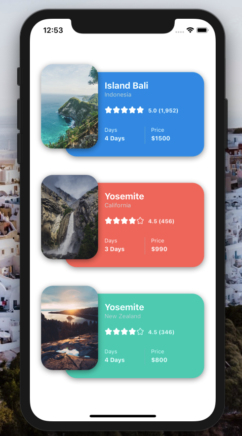

[](https://github.com/WrathChaos/react-native-imaged-card-view)


[](https://github.com/WrathChaos/react-native-imaged-card-view)


[](https://www.npmjs.com/package/react-native-imaged-card-view)
[](https://www.npmjs.com/package/react-native-imaged-card-view)

[](https://opensource.org/licenses/MIT)
[](https://github.com/prettier/prettier)

<p align="center">
   
   
 
</p>

## Installation

Add the dependency:
****
### React Native:

```ruby
npm i react-native-imaged-card-view
```

## Peer Dependencies

###### IMPORTANT! You need install them.

```
"react": ">= 16.8.6",
"react-native": ">= 0.60.5",
"react-native-androw": ">= 0.0.33",
"react-number-format": ">= 4.2.0",
"react-native-star-review": ">= 0.0.23",
"react-native-vector-icons": ">= 6.6.0",
"react-native-dynamic-vector-icons": ">= 0.2.1"
```

# Usage

## Import

```js
import ImagedCardView from "react-native-imaged-card-view";
```

# Basic Usage 

```js
<ImagedCardView />
```


# Fully Customizable Usage

```js
<ImagedCardView
  stars={5}
  reviews={456}
  ratings={4.5}
  title="Yosemite"
  rightSideValue="$990"
  subtitle="California"
  leftSideValue="3 Days"
  backgroundColor="#ff6460"
  source={{
    uri: yosemite
  }}
/>
```


### Configuration - Props


| Property            |   Type   |      Default       | Description                                    |
| ------------------- | :------: | :----------------: | ---------------------------------------------- |
| width               |  number  | ScreenWidth * 0.75 | change the width of the card                   |
| height              |  number  |        170         | change the height of the card                  |
| title               |  string  |    Island Bali     | set your own title                             |
| subtitle            |  string  |     Indonesia      | set your own subtitle                          |
| borderRadius        |  number  |         24         | change the border radius of the card           |
| titleColor          |  color   |       white        | change the title text's color                  |
| subtitleColor       |  color   |     "#dbdbdb"      | change the subtitle text's color               |
| backgroundColor     |  color   |     "#0a96ea"      | change the card's background color             |
| leftSideTitle       |  string  |        Days        | set your own title for left sided one          |
| leftSideValue       |  string  |       4 days       | set your own title's value for left sided one  |
| leftSideColor       |  color   |       white        | set your color for left sided title            |
| leftSideValueColor  |  color   |       white        | set your color for left sided value            |
| rightSideTitle      |  string  |       Price        | set your own title for right sided one         |
| rightSideValue      |  string  |       $1500        | set your own title's value for right sided one |
| rightSideColor      |  color   |       white        | set your color for right sided title           |
| rightSideValueColor |  color   |       white        | set your color for right sided value           |
| dividerColor        |  color   |     "#c4c4c4"      | set your color for divider                     |
| onPress             | function |     undefined      | set your own function for onPress              |

## React Native Star Review Props
Please check out **[React Native Star Review](https://github.com/WrathChaos/react-native-star-review)** for StarReview Props 
It is also fully customizable


### Future Plans

- [x] LICENSE
- [ ] Write an article about the lib on Medium

# Change Log

Change log will be here !

# Credits
I inspired the design by **[Olivia Graphics](https://dribbble.com/shots/6572604-Travel-App-Design)**. Thank you for this awesome design :)

## Author

FreakyCoder, kurayogun@gmail.com

## License

React Native Imaged Card View is available under the MIT license. See the LICENSE file for more info.
